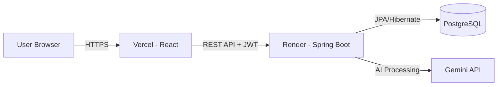

#  SkillSync SkillSync – AI Resume Intelligence Platform

> A full-stack AI-powered web application to analyze, score, and optimize resumes based on job descriptions.

---

## 🌍 Live Demo

- 🔗 Frontend (Vercel): https://skillsync-app-coral.vercel.app  
- ⚙ Backend (Render): https://skillsync-ai-zx81.onrender.com  
- ⚙ Backend (Repo): https://github.com/melonmusk20/skillsync-backend.git
---

## ✨ Features

- 📄 Upload Resume (PDF)
- 🎯 Get ATS Match Score with Job Description
- 🤖 AI-Powered Resume Optimization (Gemini API)
- 🔐 Secure Authentication using JWT
- ⚡ Fast & Responsive UI with modern animations
- 🌐 Fully deployed (Frontend + Backend)

---

## 🏗 System Architecture



---

## 🔐 Authentication Flow

1. User logs in using email & password  
2. Backend generates JWT token  
3. Token is stored in browser localStorage  
4. Axios interceptor automatically attaches token  
5. Spring Security validates JWT on every request  

---

### 🧾 Login Example

```js
const data = await loginCustomer(form);
localStorage.setItem("token", data.token);
```

---

### 🔁 Axios Interceptor

```js
api.interceptors.request.use((config) => {
  const token = localStorage.getItem("token");

  const isAuthRoute =
    config.url?.includes("/auth/login") ||
    config.url?.includes("/customers/register");

  if (!isAuthRoute && token && token !== "undefined" && token !== "null") {
    config.headers.Authorization = `Bearer ${token}`;
  }

  return config;
});
```

---

## ⚙️ Tech Stack

### 🖥 Frontend
- React (Vite)
- Axios
- React Router
- CSS Animations
- Vercel Deployment

### ⚙ Backend
- Spring Boot
- Spring Security (JWT)
- Hibernate / JPA
- PostgreSQL
- Render Deployment

### 🤖 AI Integration
- Gemini API
- Resume Optimization
- Match Score Analysis

---

## 📂 Project Structure

```bash
frontend/
│
├── src/
│   ├── api/
│   │   ├── api.js
│   │   └── endpoints.js
│   ├── pages/
│   │   ├── Login.jsx
│   │   ├── Register.jsx
│   │   └── ResumeTool.jsx
│   ├── App.jsx
│   └── main.jsx
│
├── public/
├── .env
└── package.json


backend/
│
├── config/
│   ├── SecurityConfig.java
│   └── JwtAuthFilter.java
├── controller/
├── service/
├── repository/
├── model/
└── application.properties
```

---

## 🔎 API Endpoints

| Method | Endpoint | Auth | Description |
|--------|----------|------|-------------|
| POST | `/customers/register` | ❌ | Register user |
| POST | `/auth/login` | ❌ | Login & get JWT |
| POST | `/resume/upload` | ✅ | Upload resume |
| POST | `/resume/match` | ✅ | Get ATS score |
| POST | `/resume/{id}/optimize` | ✅ | Optimize resume |

---

## 🌍 Environment Variables

### Frontend (.env)

```env
VITE_API_BASE_URL=https://skillsync-ai-zx81.onrender.com
```

### Backend (Render)

- `JWT_SECRET=your_secret`
- `GEMINI_API_KEY=your_api_key`
- `SPRING_DATASOURCE_URL=...`

---

## 🚀 Local Setup

### Frontend

```bash
npm install
npm run dev
```

Runs on:
```
http://localhost:5173
```

---

### Backend

```bash
mvn spring-boot:run
```

Runs on:
```
http://localhost:8080
```

---

## 🧠 Key Highlights

- 🔐 Secure JWT Authentication
- 🌐 Full-stack deployment (Vercel + Render)
- 🤖 AI-powered resume optimization
- 📊 ATS scoring system
- ⚡ Clean UI with responsive design

---

## 📈 Future Improvements

- Resume history dashboard
- Download optimized resume (PDF)
- AI suggestions with scoring breakdown
- Refresh token authentication
- CI/CD pipeline
